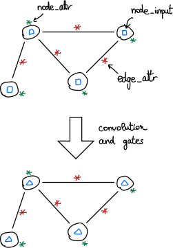

Models of March 2021
====================

Simple Network
--------------

Let's create a simple network and evaluate it on random data.

.. jupyter-execute::

    import torch
    from e3nn.nn.models.v2103 import SimpleNetwork

    net = SimpleNetwork(
        irreps_in="3x0e + 2x1o",
        irreps_out="1x1o",
        max_radius=2.0,
        num_neighbors=3.0,
        num_nodes=5.0
    )

    pos = torch.randn(5, 3)
    x = net.irreps_in.randn(5, -1)

    net({
        'pos': pos,
        'x': x
    })

If we rotate the inputs,

.. jupyter-execute::

    from e3nn import o3

    rot = o3.matrix_x(torch.tensor(3.14 / 3.0))
    rot

.. jupyter-execute::

    net({
        'pos': pos @ rot.T,
        'x': x @ net.irreps_in.D_from_matrix(rot).T
    })

it gives the same result as rotating the outputs.

.. jupyter-execute::

    net({
        'pos': pos,
        'x': x
    }) @ net.irreps_out.D_from_matrix(rot).T

Network for a graph with node/edge attributes
---------------------------------------------

A graph is made of nodes and edges.
The nodes and edges can have attributes.
Usually their only attributes are the positions of the nodes :math:`\vec r_i` and the relative positions of the edges :math:`\vec r_i - \vec r_j`.
We typically don't use the node positions because they change with the global translation of the graph.
The nodes and edges can have other attributes like for instance atom type or bond type and so on.

The attributes defines the graph properties. They don't change layer after layer (in this example).
The data (``node_input``) flow through this graph layer after layer.

In the following network, the edges attributes are the spherical harmonics :math:`Y^l(\vec r_i - \vec r_j)` plus the extra attributes provided by the user.

.. jupyter-execute::

    from e3nn.nn.models.v2103 import NetworkForAGraphWithAttributes
    from torch_cluster import radius_graph

    max_radius = 3.0

    net = NetworkForAGraphWithAttributes(
        irreps_node_input="0e+1e",
        irreps_node_attr="0e+1e",
        irreps_edge_attr="0e+1e",  # attributes in extra of the spherical harmonics
        irreps_node_output="0e+1e",
        max_radius=max_radius,
        num_neighbors=4.0,
        num_nodes=5.0,
    )

    num_nodes = 5
    pos = torch.randn(num_nodes, 4)
    edge_index = radius_graph(pos, max_radius)
    num_edges = edge_index.shape[1]

    net({
        'pos': pos,
        'edge_index': edge_index,
        'node_input': torch.randn(num_nodes, 4),
        'node_attr': torch.randn(num_nodes, 4),
        'edge_attr': torch.randn(num_edges, 4),
    })
