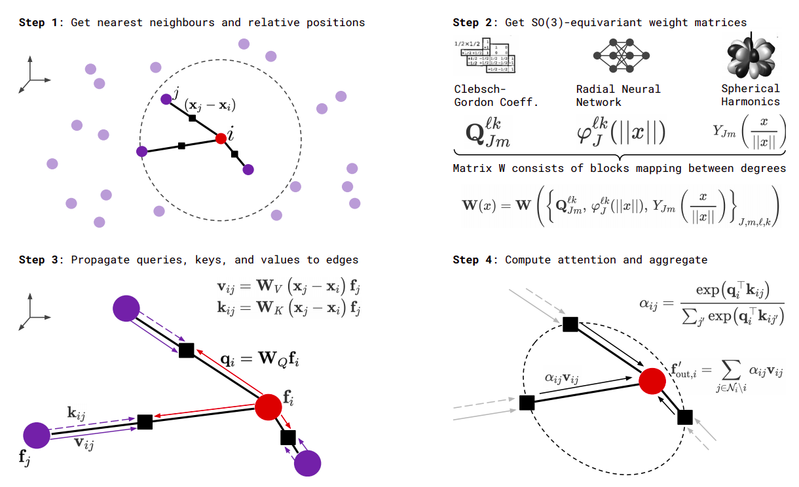

Attention mechanism
===================

(Add some text to tell that attention mechanism is well known)

.. jupyter-execute::
    :hide-code:

    import torch
    import torch
    import math
    from torch_cluster import radius_graph
    from torch_scatter import scatter
    from e3nn import o3, nn, io
    from e3nn.math import soft_unit_step, soft_one_hot_linspace
    import matplotlib.pyplot as plt

In this document we will see how to implement an equivariant attention mechanism with ``e3nn``.
We will implement the formula (1) of `SE(3)-Transformers`_. The output features :math:`f'` are computed by

.. math::

    f'_i = \sum_{j=1}^n \alpha_{ij} v_j

    \alpha_{ij} = \frac{\exp(q_i^T k_j)}{\sum_{j'=1}^n \exp(q_i^T k_{j'})}

where :math:`q, k, v` are respectively called the queries, keys and values.
They are function of the input features :math:`f`.

.. math::

    q = h_Q(f)

    k = h_K(f)

    v = h_V(f)

all these formula are well illustrated by the figure (2) of the same article.

First we need to define the irreps of the inputs, the queries, the keys and the ouputs.
Note that outputs and values share the same irreps.

.. jupyter-execute::

    irreps_input = o3.Irreps("10x0e + 5x1o")
    irreps_query = o3.Irreps("11x0e + 4x1o")
    irreps_key = o3.Irreps("12x0e + 3x1o")
    irreps_output = o3.Irreps("14x0e + 6x1o")  # also irreps of the values

Lets create a random graph on which we can apply the attention mechanism:

.. jupyter-execute::

    num_graph = 3
    num_nodes = 20

    pos = torch.randn(num_graph * num_nodes, 3)
    f = irreps_input.randn(num_graph * num_nodes, -1)
    batch = torch.arange(num_graph * num_nodes) % num_graph

    # create graph
    max_radius = 1.3
    edge_src, edge_dst = radius_graph(pos, max_radius, batch)
    edge_vec = pos[edge_src] - pos[edge_dst]
    edge_length = edge_vec.norm(dim=1)

The queries :math:`q_i` are a linear combination of the input features :math:`f_i`.

.. jupyter-execute::

    h_q = o3.Linear(irreps_input, irreps_query)

In order to generate weights that depends on the radii, we project the edges length on a basis:

.. jupyter-execute::

    number_of_basis = 10
    edge_length_embedded = soft_one_hot_linspace(edge_length, 0.0, max_radius, number_of_basis, 'smooth_finite', False)
    edge_length_embedded = edge_length_embedded.mul(number_of_basis**0.5)

To create the values and the keys we have to use the relative position of the edges. We will use the spherical harmonics to have a richer describtor of the relative positions:

.. jupyter-execute::

    irreps_sh = o3.Irreps.spherical_harmonics(3)
    edge_sh = o3.spherical_harmonics(irreps_sh, edge_vec, True, normalization='component')

We will make a tensor prodcut between the input and the spherical harmonics of the relative positions and tensor product that with the input to create the values and keys.

.. jupyter-execute::

    tp_k = o3.FullyConnectedTensorProduct(irreps_input, irreps_sh, irreps_key, shared_weights=False)
    fc_k = nn.FullyConnectedNet([number_of_basis, tp_k.weight_numel])

    tp_v = o3.FullyConnectedTensorProduct(irreps_input, irreps_sh, irreps_output, shared_weights=False)
    fc_v = nn.FullyConnectedNet([number_of_basis, tp_v.weight_numel])

For the correpondance with the formula, ``tp_v, fc_v`` represent :math:`h_K` and ``tp_v, fc_v`` represent :math:`h_V`.
Then we need a way to compute the dot product between the queries and the keys:

.. jupyter-execute::

    dot = o3.FullyConnectedTensorProduct(irreps_query, irreps_key, "0e")

The operations ``tp_k``, ``tp_v`` and ``dot`` can be visualized as follow:

.. jupyter-execute::
    :hide-code:

    _, [ax1, ax2, ax3] = plt.subplots(1, 3, figsize=(9, 2.5))
    plt.sca(ax1)
    tp_k.visualize()
    plt.sca(ax2)
    tp_v.visualize()
    plt.sca(ax3)
    dot.visualize()
    plt.tight_layout()

Finally we can just use all the modules to compute the attention mechanism:

.. jupyter-execute::

    # compute the queries (per node), keys (per edge) and values (per edge)
    q = h_q(f)
    k = tp_k(f[edge_src], edge_sh, fc_k(edge_length_embedded))
    v = tp_v(f[edge_src], edge_sh, fc_v(edge_length_embedded))

    # compute the softmax (per edge)
    exp = dot(q[edge_dst], k).exp()  # compute the numerator
    z = scatter(exp, edge_dst, dim=0, dim_size=len(f))  # compute the denominator (per nodes)
    alpha = exp / z[edge_dst]

    # compute the outputs (per node)
    f_out = scatter(alpha.sqrt() * v, edge_dst, dim=0, dim_size=len(f))

Note that this implementation has small differences with the article.

- In this implementation the ``dot`` operation has weights (why not?).
- The radial neural networks are feed with embeddings that goes smoothly to zero when the edge length reach ``max_radius``. This ensure that the hole operation is smooth when we move the points (deleting/creating new edges).
- The output is weight with :math:`\sqrt(\alpha_{ij})` instead of :math:`\alpha_{ij}` to ensure a proper normalization. As checked below.

.. jupyter-execute::

    f_out.mean(), f_out.std()

.. _SE(3)-Transformers: https://proceedings.neurips.cc/paper/2020/file/15231a7ce4ba789d13b722cc5c955834-Paper.pdf
